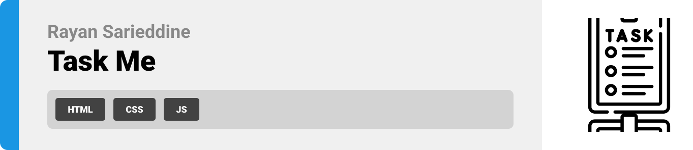
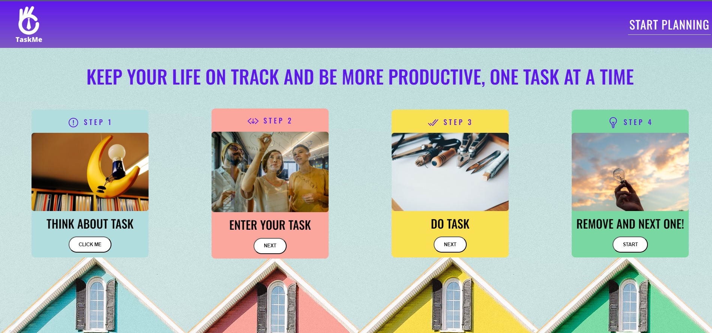
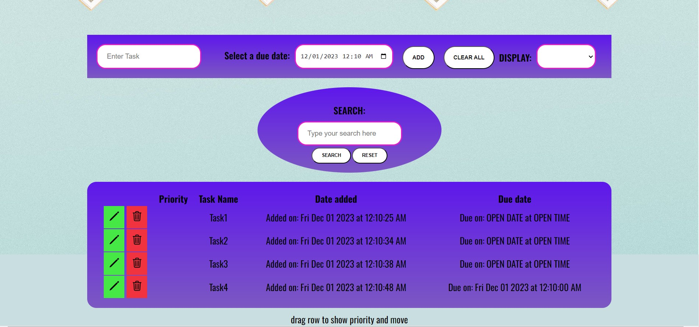

  

<!-- project philosophy -->

# This is my TO_DO_LIST web application named TaskMe. It is made with pure HTML, CSS and JS and contains the following functionalities:

> -Add tasks  
> -Delete tasks individually  
> -Clear all tasks at once  
> -Update (edit) tasks  
> -Add due date and date of adding tasks  
> -Mark tasks as finished or not by clicking on them  
> -Drag and drop tasks and give priorities to each one based on that drag and drop  
> -Display tasks based on filter (finished and unfinished tasks)  
> -Search for tasks by name (check if tasks exist or not)

  

<!-- Prototyping -->

| 
| 
